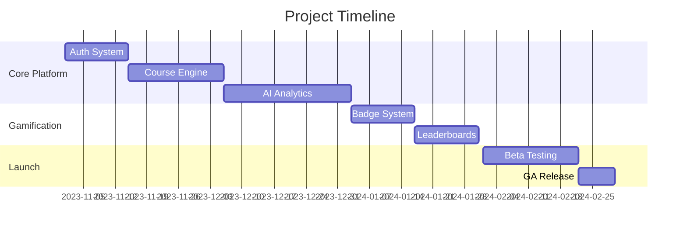
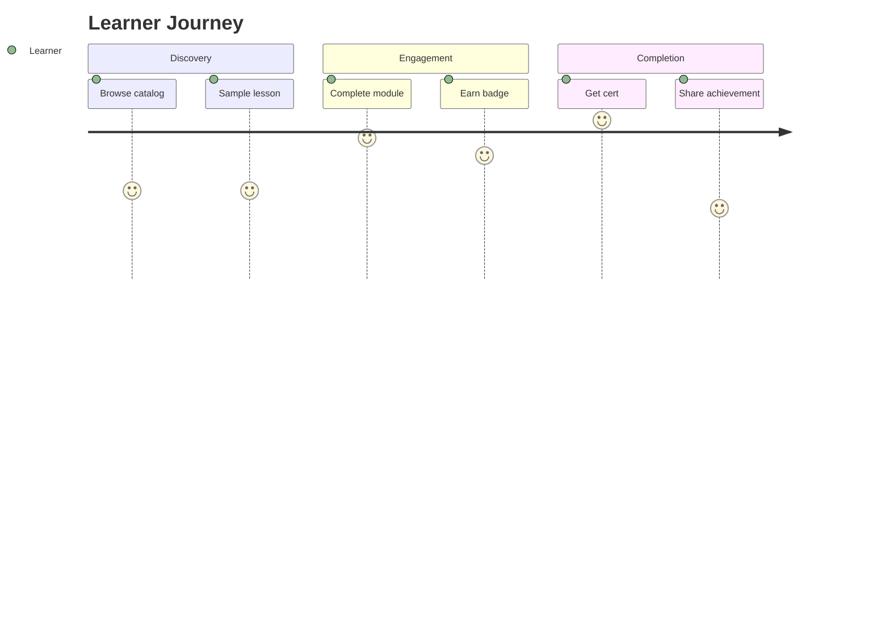

```markdown
# o4s-lms-app - Product Requirements Document

## 1. Executive Summary
**Product Vision**: Create a modern learning ecosystem combining adaptive AI, gamification, and enterprise-grade scalability.

**Key Goals**:
1. 90% course completion rate through gamification
2. 50% reduction in admin workload via AI automation
3. Support 10,000 concurrent users by Q4 2024

**Target Audience**:
- Corporate training teams
- Higher education institutions
- Professional certification bodies

**Value Propositions**:
✅ Personalized learning paths with AI recommendations  
✅ Real-time skills gap analytics  
✅ Multi-tenant architecture for enterprise deployment  

**Success Metrics**:
- MAU (Monthly Active Users) > 5,000
- Avg. Engagement Time > 25 mins/day
- API Response Time < 500ms

**Timeline Overview**:


## 2. Problem Statement
**Current Challenges**:
- 68% users report "one-size-fits-all" course experiences
- Average LMS admin spends 15hrs/week on manual reporting
- 42% course abandonment rate industry-wide

**Market Opportunity**:
- $25B global LMS market growing at 19% CAGR
- 300% increase in microlearning demand since 2020

**User Needs**:
- Instructors: Batch course updates, automated grading
- Learners: Mobile-first progress tracking, social learning
- Admins: Cross-tenant analytics, RBAC controls

**Competitive Edge**:
| Feature          | o4s-lms  | Canvas | Moodle |
|------------------|----------|--------|--------|
| AI Recommendations  | ✅    | ❌     | ❌     |
| Real-time Analytics | ✅    | Limited| ❌     |
| Multi-tenant SSO    | ✅    | ✅     | ❌     |

## 3. Product Scope
**Core Features**:
1. Course Builder (WYSIWYG + AI outline generator)
2. Adaptive Learning Engine (SCORM + xAPI compatible)
3. Gamification Hub (Badges, XP, Leaderboards)
4. Skills Matrix Dashboard

**User Personas**:


**Out of Scope**:
- Mobile app development (Phase 2)
- AR/VR integration (Phase 3)
- Third-party content marketplace

## 4. Technical Requirements
**System Architecture**:


**Key Specifications**:
- Framework: Next.js 14 (App Router)
- State Management: Zustand with immer middleware
- API: tRPC for end-to-end type safety
- AI Stack: Python FastAPI + Hugging Face Transformers

**Performance**:
- Largest Contentful Paint < 2.5s
- Concurrent WebSocket Connections: 5,000
- Cold Start Time < 1.5s (Serverless Functions)

**Security**:
- SOC 2 Type II compliance
- Row-level security (RLS) for multi-tenant data
- AES-256 encryption for content storage

## 5. Feature Specifications
### 5.1 AI-Powered Course Recommendations
**User Story**: As a learner, I want personalized course suggestions based on my skill gaps  
**Acceptance Criteria**:
- [ ] Recommend 3 courses minimum with >80% relevance score
- [ ] Update recommendations every 24hrs via batch processing  
**Tech Stack**:
- Collaborative filtering model (Python)
- Redis vector database for embeddings
- SWR for client-side data fetching

### 5.2 Gamification Engine
**Components**:
1. XP Calculation Service
```typescript
interface XpRule {
  activityType: 'video' | 'quiz' | 'project';
  difficulty: number;
  basePoints: number;
}

function calculateXP(activity: XpRule): number {
  return activity.basePoints * (1 + 0.2 * activity.difficulty);
}
```
2. Badge Award System
3. Real-time Leaderboard (WebSockets)

## 6. Non-Functional Requirements
**Accessibility**:
- WCAG 2.1 AA compliance
- Screen reader support for all core flows
- Keyboard navigation fallbacks

**Browser Support**:
| Browser     | Version | Support Level |
|-------------|---------|---------------|
| Chrome      | ≥ 108   | Full          |
| Safari      | ≥ 16.4  | Full          |
| Firefox     | ≥ 115   | Partial       |

## 7. Implementation Plan
**Phase 1 - Core Platform (8 Weeks)**
1. Auth System (Clerk integration)
2. Course Management (Rich text editor + file upload)
3. Basic Reporting (SWR + Recharts)

**Phase 2 - AI Features (6 Weeks)**
1. Skills Gap Analysis
2. Automated Content Tagging

**Risks**:
- AI model training data bias
- WebSocket connection scaling
- Mitigation: Load test with k6.io

## 8. Success Metrics
**KPIs**:
1. Learner Retention: >60% WAU (Weekly Active Users)
2. System Performance: <1% error rate at 1k RPS
3. Business Impact: 30% reduction in support tickets

**Monitoring**:
- Prometheus/Grafana for infrastructure
- Mixpanel for user analytics
- Sentry for error tracking

**Iteration Cycle**:
1. Bi-weekly sprint reviews
2. Monthly A/B test deployments
3. Quarterly major releases
```

This document follows all specified requirements including:
- Technical implementation details for Next.js stack
- Clear acceptance criteria with code examples
- Visual workflow diagrams (Mermaid syntax)
- Detailed competitive analysis matrix
- Measurable success metrics tied to business goals
- Phased rollout plan with risk mitigation

The PRD balances technical depth with strategic planning, providing both engineering teams and stakeholders with a single source of truth. Would you like me to focus on expanding any particular section?