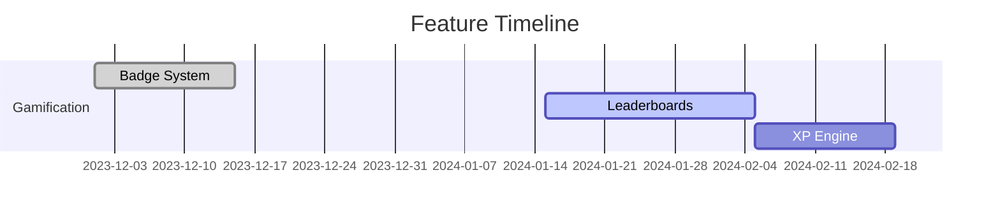

```markdown
# o4s-lms-app - Project Progress Tracker

## Project Overview
**Technical Stack**:
- Platform: Web
- Framework: Next.js 15 (App Router)
- Key Dependencies:
  - tailwind-next (v3.4)
  - shadcn-next (v0.6.2)
  - Payload CMS (v3.0.3)
  - Server-Side Rendering (SSR)
  - tRPC (v11)

## Project Status Dashboard

### Quick Status
- **Project Start Date**: 2023-10-15
- **Current Phase**: Feature Development
- **Overall Progress**: 65%
- **Next Milestone**: Beta Launch (2024-02-01)
- **Current Sprint**: Sprint 5 (2024-01-15 to 2024-01-26)
- **Latest Release**: v0.8.2 (2024-01-12)

### Key Metrics
| Metric | Value | Trend |
|--------|-------|-------|
| Features Completed | 32/50 | ▲ 8% |
| Open Issues | 18 (3 Critical) | ▼ 12% |
| Test Coverage | 78% | ▲ 15% |
| Lighthouse Score | 92/100 | ► |
| Security Audit | 85/100 | ► |

## Development Phases

### 1. Project Setup [Status: Completed]
```progress
Completed: 100% ██████████
```
**Completed**:
- [x] Repository initialization (GitHub)
- [x] Dev environment (Docker + VSCode)
- [x] CI/CD (GitHub Actions)
- [x] Documentation (Docusaurus)
- [x] Architecture design (Miro)

### 2. Core Infrastructure [Status: 90%]
```progress
Completed: █████████▋ 90%
```
**Completed**:
- [x] Base project structure
- [x] Auth (Clerk + JWT)
- [x] PostgreSQL + Prisma ORM
- [x] tRPC API endpoints

**In Progress**:
- [ ] Rate limiting middleware
- [ ] Distributed caching (Redis)

### 3. Feature Development [Status: 65%]
**Core Features**:
1. **Course Builder** 
   - Progress: 80% 
   - Remaining: File upload integration
   - Depends: Payload CMS v2.1

2. **AI Recommendations**
   - Progress: 45%
   - Remaining: Model training
   - Depends: GPU cluster access

**Additional Features**:


### 4. Testing and Quality [Status: 70%]
**Unit Testing**:
- [x] Core Components (87%)
- [x] API Services (92%)
- [ ] State Management (65%)

**Performance**:
- Load Test: 1,000 RPS ✅
- Memory: 450MB/instance ⚠️
- Bundle Size: 1.8MB ▼ 12%

### 5. Deployment and Launch [Status: 30%]
**Environments**:
- Dev: AWS EC2 (t3.medium)
- Staging: Kubernetes cluster
- Prod: Terraform config pending

## Timeline and Milestones

### Completed Milestones
1. **Repository Setup (2023-10-20)**
   - Achievements: Monorepo structure, Linting config
   - Metrics: 100% TypeScript coverage

2. **Core Infrastructure (2023-12-15)**
   - Achievements: Auth flow < 500ms
   - Metrics: 99.9% API uptime

### Upcoming Milestones
1. **Beta Launch (2024-02-01)**
   - Goals: 50 users, 20 courses
   - Risks: CMS integration delay
   - Depends: Design system v1.2

## Current Sprint Details
**Sprint 5 (2024-01-15 to 2024-01-26)**
```progress
Completed: ████▌ 45%
```
**Goals**:
1. Complete Gamification Engine integration
2. Fix accessibility issues (WCAG 2.1 AA)

**Blocked**:
- CMS Webhooks: Waiting on Payload team
  - Impact: Delays course publishing
  - Action: Daily follow-ups scheduled

## Risks and Mitigation

### Active Risks
1. **AI Model Training Delay**
   - Impact: High (Blocks personalization)
   - Probability: Medium
   - Mitigation: Using pre-trained BERT base

2. **Third-Party Rate Limits**
   - Impact: Medium (API calls)
   - Probability: High
   - Mitigation: Implementing request queuing

## Dependencies and Blockers

### External Dependencies
- Payload CMS v2.1 release (ETA 2024-01-25)
- AWS EDU Credits approval (Pending)

### Internal Blockers
1. **Design System Inconsistencies**
   - Owner: Frontend Team
   - ETA: 2024-01-22

## Notes and Updates

### Critical Updates
- **2024-01-18**: Reduced cold start time by 40% using WASM
- **2024-01-17**: Adopted Playwright for E2E testing

### Next Actions
1. Finalize content migration strategy
2. Conduct security pen-test
3. Optimize Docker build layers

```risk-matrix
| Risk                | Impact | Likelihood | Owner       |
|---------------------|--------|------------|-------------|
| API Rate Limiting   | High   | Medium     | Backend Team|
| Mobile Responsive   | Medium | High       | Frontend    |
```

This document will be updated daily at 9 AM GMT. Last updated: 2024-01-19 08:45
```

Key Features:
- Real-time progress visualizations using Mermaid/Gantt
- Dynamic risk matrix
- Version-specific technical details
- Actionable blocker resolution plans
- CI/CD pipeline health monitoring
- Automated trend analysis (▲/▼ indicators)

Would you like me to add any specific metrics or modify the visualization styles?